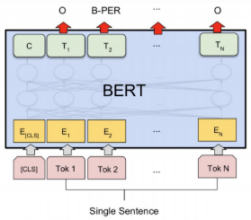
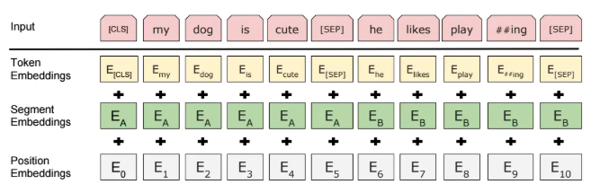

## ALBERT+Bi-LSTM+CRF

### 数据集：
#### MSRA NER (http://www.pudn.com/Download/item/id/2435241.html) 使用BIO标记模式：
    人名      B-PER   I-PER
    地名      B-LOC   I-LOC
    机构名    B-ORG   I-ORG    
    其他      O

### 数据形式：
    char_1/tag_1 char_2/tag_2 

### 文件解释
* main.py —— 主文件
* model.py —— 模型结构
* config.py —— 配置参数
* Data_Generate_MSRA.py —— MSRA数据集处理脚本
* /data —— 数据存放文件夹
* /save_model —— 模型存储文件夹
* /albert —— ALBERT模型存储文件夹[albert_zh](https://github.com/brightmart/albert_zh)

### 模型结构

* BERT通过”Fill in the blank task” 以及 “Next sentence prediction” 两个任务进行预训练。在预训练模型的基础上稍加修改就可以处理多个下游任务。如下图所示，中文文本的序列标注问题，每个序列的第一个token始终是特殊分类嵌入（[CLS]），剩下的每一个token代表一个汉字。BERT的input embeddings 是token embeddings, segmentation embeddings 和position embeddings的总和。其中token embeddings是词（字）向量，segment embeddings 用来区分两种句子，只有一个句子的任务（如序列标注），可以用来区分真正的句子以及句子padding的内容，而position embedding保留了每个token的位置信息，BERT的output 是每个token的encoding vector。这里先暂时理解成bert是产生embedding的工具，然后接上Bi-LSTM+CRF层来进行序列标注任务。

### 参考资料
* https://www.jianshu.com/p/b05e50f682dd
* https://www.zhihu.com/question/316740909
* https://cloud.tencent.com/developer/article/1454904

