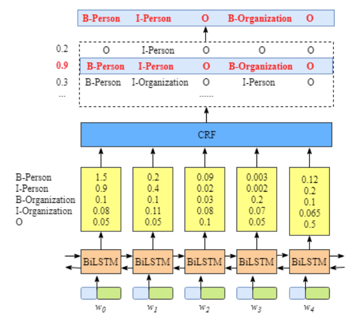

## Bi-LSTM+CRF (Bidirectional LSTM-CRF Models for Sequence Tagging)

### 数据集：
#### MSRA NER (http://www.pudn.com/Download/item/id/2435241.html) 使用BIO标记模式：
    人名      B-PER   I-PER
    地名      B-LOC   I-LOC
    机构名    B-ORG   I-ORG    
    其他      O

### 数据形式：
    char_1/tag_1 char_2/tag_2 

### 文件解释
* main.py —— 主文件
* model.py —— 模型结构
* config.py —— 配置参数
* Data_Generate_MSRA.py —— MSRA数据集处理脚本
* /data —— 数据存放文件夹
* /save_model —— 模型存储文件夹

### 模型结构

* 句子𝑥中的每一个单元都代表着由character embedding或word embedding构成的向量。其中，character embedding是随机初始化的，word embedding是通过数据训练得到的。所有的 embeddings 在训练过程中都会调整到最优。
* 这些 embeddings 为BiLSTM-CRF模型的输入，输出的是句子𝑥中每个单元的标签。

### 参考资料
* Bidirectional LSTM-CRF Models for Sequence Tagging (https://arxiv.org/pdf/1508.01991v1.pdf)
* https://zhuanlan.zhihu.com/p/97676647
* https://www.cnblogs.com/ltolstar/p/11975937.html

