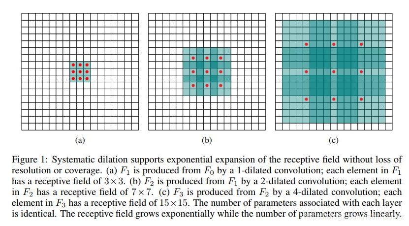
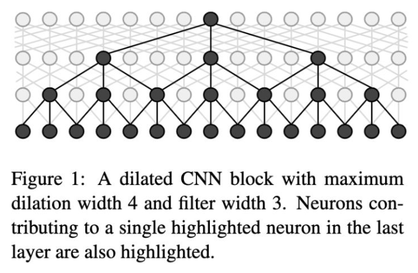

## IDCNN (Fast and Accurate Entity Recognition with Iterated Dilated Convolutions)

### 数据集：
#### MSRA NER (http://www.pudn.com/Download/item/id/2435241.html) 使用BIO标记模式：
    人名      B-PER   I-PER
    地名      B-LOC   I-LOC
    机构名    B-ORG   I-ORG    
    其他      O

### 数据形式：
    char_1/tag_1 char_2/tag_2 

### 文件解释
* main.py —— 主文件
* model.py —— 模型结构
* config.py —— 配置参数
* Data_Generate_MSRA.py —— MSRA数据集处理脚本
* /data —— 数据存放文件夹
* /save_model —— 模型存储文件夹

### 模型结构

* 目前，Bi-LSTM+CRF被广泛应用于NER任务中，尽管Bi-LSTM在NER任务中有很好的表现，但是却不能充分利用GPU的并行性，因此论文提出了一种更快的替代方案-Iterated Dilated Convolutional Neural Networks(ID-CNNs)；相较于传统的CNN，IDCNN能够捕捉更长的上下文信息，同时，相比于LSTM，IDCNN能够实现并行计算。
* Dilated Convolutions，中文意思大概是“膨胀卷积”。正常CNN的filter，都是作用在输入矩阵一片连续的位置上，不断sliding做卷积，接着通过pooling来整合多尺度的上下文信息，这种方式会损失分辨率。既然网络中加入pooling层会损失信息，降低精度。那么不加pooling层会使感受野变小，学不到全局的特征。如果我们单纯的去掉pooling层、扩大卷积核的话，这样纯粹的扩大卷积核势必导致计算量的增大，此时最好的办法就是Dilated Convolutions（膨胀卷积或叫空洞卷积）。

### 参考资料
* Fast and Accurate Entity Recognition with Iterated Dilated Convolutions (https://arxiv.org/abs/1702.02098)
* https://zhuanlan.zhihu.com/p/267372400

