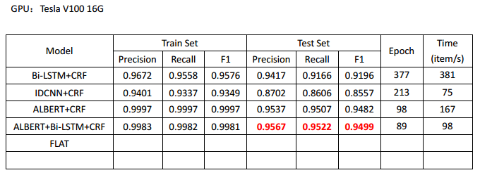

# Named Entity Recognition (NER) Based on MSRA

### 模型
* IDCNN+CRF
* Bi-LSTM+CRF
* ALBERT+Bi-LSTM+CRF

### 数据集：
#### MSRA NER (http://www.pudn.com/Download/item/id/2435241.html) 使用BIO标记模式：
    人名      B-PER   I-PER
    地名      B-LOC   I-LOC
    机构名    B-ORG   I-ORG    
    其他      O

### 数据形式：
    char_1/tag_1 char_2/tag_2 

### 依赖环境
    Python 3.6
    TensorFlow 1.15

### 模型对比：

* 以上结果只是对模型做了基本测试与验证、参数也不一定是最优，如果需用在具体项目中，可自行调试。

